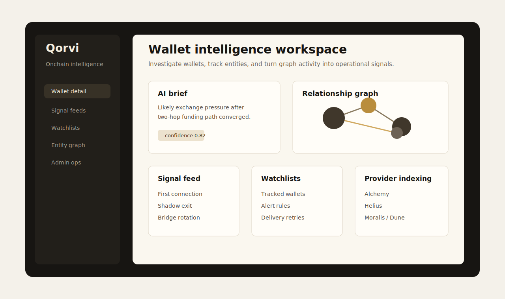
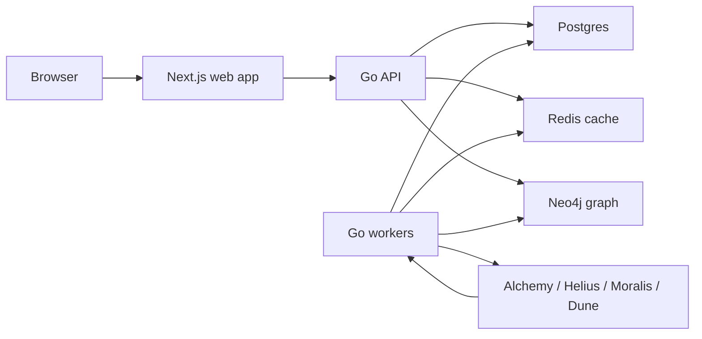

# Qorvi

Qorvi is an onchain intelligence workspace for teams that need to investigate wallets, monitor high-risk activity, and turn raw blockchain transactions into graph-backed operational signals.

It brings wallet context, entity relationships, watchlists, alerting, and analyst workflows into one product surface so operators can move from "what happened?" to "what should we track next?"



## What Qorvi Does

- **Investigate wallets:** inspect wallet activity, graph context, related entities, and historical behavior from a single workspace.
- **Find signal in graph activity:** surface first-connection and shadow-exit style events that can indicate meaningful movement.
- **Track entities over time:** maintain watchlists and monitored wallets with provider-backed indexing and enrichment loops.
- **Operate alerts:** define alerting workflows, retry delivery, and keep investigation handoffs connected to product state.
- **Support analyst review:** preserve findings, interpretation contracts, and AI-ready schemas for repeatable analyst workflows.

## Core Workflows

- **Wallet detail:** address-level context, chain activity, relationship summaries, and graph-oriented investigation views.
- **Graph exploration:** Neo4j-backed cluster, entity, and wallet relationship surfaces.
- **Signal feeds:** product feeds for unusual movement, early links, and monitored-wallet activity.
- **Watchlists:** tracked wallet/entity workflows that connect ingestion, enrichment, and alerts.
- **Admin operations:** account, billing, provider status, and internal operational controls.

## Architecture



## Tech Stack

- **Frontend:** Next.js 14, React 18, TypeScript, Biome, Playwright, `@xyflow/react`, `react-force-graph-2d`, Three.js.
- **Backend:** Go API with service/repository layers and package-level test coverage.
- **Workers:** Go worker modes for backfill, indexing, alerts, billing sync, tracking sync, enrichment, and delivery retries.
- **Data:** Postgres for product state, Neo4j for graph relationships, Redis for caching/coordination.
- **Integrations:** Clerk, Stripe, Alchemy, Helius, Moralis, Dune.
- **Infra:** Docker Compose for local and single-host deployments, Terraform for a low-cost GCP backend shape, Vercel-ready frontend config.

## Repository Layout

```text
apps/
  api/       Go HTTP API and application services
  web/       Next.js operator UI
  workers/   Go background workers and ingestion loops
packages/
  billing/       Stripe/billing primitives
  config/        shared configuration helpers
  db/            persistence adapters
  domain/        shared domain model
  intelligence/  scoring and signal primitives
  ops/           operational helpers
  providers/     chain/provider clients
  ui/            shared frontend package
infra/
  docker/      local and single-host compose files
  migrations/  Postgres and Neo4j migrations
  seeds/       repository-safe seed data documentation
terraform/     GCP VM deployment shape
flowintel-ai/  analyst contracts, datasets, eval notes, and AI roadmap
```

The internal package namespace still uses `flowintel` while the product name is being migrated to Qorvi.

Internal planning notes, task backlogs, and local draft environment files are intentionally kept out of the public repository root so the project reads as a product codebase rather than a working scratchpad.

## Local Development

### Prerequisites

- Node.js 22+
- pnpm via Corepack
- Go 1.24+
- Docker

### Setup

```bash
corepack enable
corepack pnpm install
cp .env.example .env
```

Update `.env` with real provider/auth keys only when you need those integrations. The default local database, Redis, and Neo4j URLs match the Docker Compose stack.

### Run The Full Local Stack

```bash
corepack pnpm dev:stack
```

This starts Docker infrastructure, applies migrations, starts the API on `http://localhost:4000`, starts the web app on `http://localhost:3000`, and starts the default worker loop.

To run without workers:

```bash
corepack pnpm dev:stack:no-worker
```

### Run Services Separately

```bash
corepack pnpm dev:infra
corepack pnpm dev:migrate
corepack pnpm dev:api
corepack pnpm dev:web
corepack pnpm dev:workers
```

## Quality Checks

```bash
corepack pnpm check
```

The aggregate check runs frontend linting, frontend type checks, frontend tests, Go vet, and Go tests across the Go modules.

Useful targeted checks:

```bash
corepack pnpm lint:web
corepack pnpm typecheck:web
corepack pnpm test:web
corepack pnpm go:test
```

## Configuration

Environment templates:

- [.env.example](.env.example) for local development.
- [.env.beta.example](.env.beta.example) for beta-style deployments.
- [.env.production.example](.env.production.example) for production-style deployments.

Do not commit real secrets. Local `.env` files are intentionally ignored.

## Deployment

The current low-cost deployment shape is documented in [docs/deployment-architecture.md](docs/deployment-architecture.md).

Recommended early deployment shape:

- Frontend on Vercel at `qorvi.app`.
- Backend on a single GCP Compute Engine VM at `api.qorvi.app`.
- Docker Compose on the VM for API, Postgres, Redis, Neo4j, and optional workers.
- Terraform-managed VM/network/firewall resources in [terraform/](terraform/).

Other deployment assets:

- [infra/docker/docker-compose.prod.yml](infra/docker/docker-compose.prod.yml) for a single-host Docker Compose shape.
- [render.yaml](render.yaml) for a Render-oriented deployment shape.
- [docs/runbooks/](docs/runbooks/) for beta and production readiness checklists.

## Public Repo Notes

- This is a public-source product repository, not an open-source package for reuse. See [LICENSE](LICENSE).
- Repository-managed seed data is documented in [infra/seeds/README.md](infra/seeds/README.md).
- Real secrets should live only in local `.env` files or deployment provider secret stores.
- Test fixtures may contain placeholder credentials; these are not live provider keys.

## Product Direction

Qorvi is designed around a practical product gap: onchain monitoring tools often expose raw transactions, but operators need a workflow that turns wallet activity into graph context, tracked entities, alertable signals, and repeatable investigation surfaces.

The product direction is to make onchain investigations more operational: less manual wallet checking, more structured context, and clearer handoffs from signal detection to analyst review.
