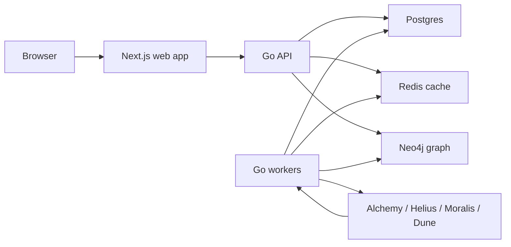

# Qorvi

Qorvi is an onchain intelligence workspace for investigating wallets, surfacing high-signal graph activity, and operating alerts around tracked entities.

It is built as a portfolio-grade prototype of the product infrastructure behind a crypto investigation platform: ingestion workers, provider integrations, graph storage, billing gates, auth, alerts, and a Next.js operator UI.

> Public-source portfolio repository. Not open-source for reuse. See [LICENSE](LICENSE).

## What It Demonstrates

- Multi-service product architecture with a Go API, Go workers, a Next.js frontend, Postgres, Redis, and Neo4j.
- Wallet intelligence workflows: wallet detail, graph exploration, cluster/entity views, watchlists, findings, and signal feeds.
- Background ingestion and enrichment loops for provider-backed historical data and ongoing indexing.
- Production-facing concerns: auth, billing, deployment shapes, environment templates, migrations, and operational runbooks.
- AI/analyst contract design for future wallet analysis and signal explanation workflows.

## Product Surface

- **Wallet investigation:** wallet detail pages, activity context, graph-oriented summaries, and linked entity views.
- **Signal feeds:** first-connection and shadow-exit style feeds for surfacing unusual wallet behavior.
- **Watchlists and alerts:** tracked wallet/entity workflows with alert delivery and retry handling.
- **Operator admin:** internal admin console, usage/billing hooks, provider status, and operational controls.
- **Graph intelligence:** Neo4j-backed graph reads for clusters, wallet relationships, and entity interpretation.

## Architecture



## Tech Stack

- **Frontend:** Next.js 14, React 18, TypeScript, Biome, Playwright, `@xyflow/react`, `react-force-graph-2d`, Three.js.
- **Backend:** Go API with service/repository layers and package-level test coverage.
- **Workers:** Go worker modes for backfill, indexing, alerts, billing sync, tracking sync, enrichment, and delivery retries.
- **Data:** Postgres for product state, Neo4j for graph relationships, Redis for caching/coordination.
- **Integrations:** Clerk, Stripe, Alchemy, Helius, Moralis, Dune.
- **Infra:** Docker Compose for local/prototype deployments, Terraform for a low-cost GCP backend shape, Vercel-ready frontend config.

## Repository Layout

```text
apps/
  api/       Go HTTP API and application services
  web/       Next.js operator UI
  workers/   Go background workers and ingestion loops
packages/
  billing/       Stripe/billing primitives
  config/        shared configuration helpers
  db/            persistence adapters
  domain/        shared domain model
  intelligence/  scoring and signal primitives
  ops/           operational helpers
  providers/     chain/provider clients
  ui/            shared frontend package
infra/
  docker/      local and single-host compose files
  migrations/  Postgres and Neo4j migrations
  seeds/       repository-safe seed data documentation
terraform/     GCP VM deployment shape
flowintel-ai/  analyst contracts, datasets, eval notes, and AI roadmap
```

The internal package namespace still uses `flowintel` while the product name is being migrated to Qorvi.

## Local Development

### Prerequisites

- Node.js 22+
- pnpm via Corepack
- Go 1.24+
- Docker

### Setup

```bash
corepack enable
corepack pnpm install
cp .env.example .env
```

Update `.env` with real provider/auth keys only when you need those integrations. The default local database, Redis, and Neo4j URLs match the Docker Compose stack.

### Run The Full Local Stack

```bash
corepack pnpm dev:stack
```

This starts Docker infrastructure, applies migrations, starts the API on `http://localhost:4000`, starts the web app on `http://localhost:3000`, and starts the default worker loop.

To run without workers:

```bash
corepack pnpm dev:stack:no-worker
```

### Run Services Separately

```bash
corepack pnpm dev:infra
corepack pnpm dev:migrate
corepack pnpm dev:api
corepack pnpm dev:web
corepack pnpm dev:workers
```

## Quality Checks

```bash
corepack pnpm check
```

The aggregate check runs frontend linting, frontend type checks, frontend tests, Go vet, and Go tests across the Go modules.

Useful targeted checks:

```bash
corepack pnpm lint:web
corepack pnpm typecheck:web
corepack pnpm test:web
corepack pnpm go:test
```

## Configuration

Environment templates:

- [.env.example](.env.example) for local development.
- [.env.beta.example](.env.beta.example) for beta-style deployments.
- [.env.production.example](.env.production.example) for production-style deployments.

Do not commit real secrets. Local `.env` files are intentionally ignored.

## Deployment

The current low-cost deployment shape is documented in [docs/deployment-architecture.md](docs/deployment-architecture.md).

Recommended prototype shape:

- Frontend on Vercel at `qorvi.app`.
- Backend on a single GCP Compute Engine VM at `api.qorvi.app`.
- Docker Compose on the VM for API, Postgres, Redis, Neo4j, and optional workers.
- Terraform-managed VM/network/firewall resources in [terraform/](terraform/).

Other deployment assets:

- [infra/docker/docker-compose.prod.yml](infra/docker/docker-compose.prod.yml) for a single-host Docker Compose shape.
- [render.yaml](render.yaml) for a Render-oriented deployment shape.
- [docs/runbooks/](docs/runbooks/) for beta and production readiness checklists.

## Public Repo Notes

- Repository-managed seed data is documented in [infra/seeds/README.md](infra/seeds/README.md).
- Real secrets should live only in local `.env` files or deployment provider secret stores.
- Test fixtures may contain placeholder values such as `sk_live_test`; these are not live credentials.
- The repository is intended to show architecture, implementation quality, and product thinking, not to provide a drop-in hosted service.

## Portfolio Narrative

Qorvi was designed around a practical product problem: onchain monitoring tools often show raw transactions, but operators need a workflow that turns wallet activity into graph context, tracked entities, alertable signals, and repeatable investigation surfaces.

The repo emphasizes the engineering needed behind that workflow: provider adapters, idempotent ingestion, graph-aware storage, worker modes, alert retries, account/billing boundaries, and deployment paths that fit an early-stage product budget.
